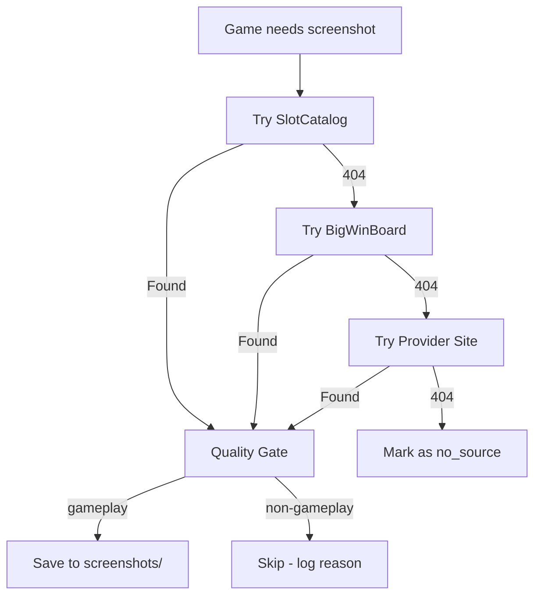

# Multi-Source Screenshot Acquisition

**Parent plan**: This is Phase 1 of the [Screenshot Acquisition and Art Classification Plan](screenshot_acquisition_for_art_5c6f45aa.plan.md).

## Problem

SlotCatalog has ~0% hit rate for 2025-2026 games (878 games). Even for older games, the pilot showed the first batch tried failed entirely because they were newer/niche titles. We need additional sources to maximize coverage while maintaining strict gameplay-only quality.

## Proposed Architecture: Waterfall with Quality Gate



## Source 1: SlotCatalog (existing)

- URL: `slotcatalog.com/en/slots/{Slug}`
- Slug: `name.replace(/\s+/g, '-')` (Title-Case-With-Hyphens)
- Gives us: screenshot + SC HTML (review text for classifier)
- Expected coverage: ~70% for 2021-2024 games, ~20% for 2025+
- Already implemented in [download_sc_screenshots_playwright.mjs](game_analytics_export/data/download_sc_screenshots_playwright.mjs)

## Source 2: BigWinBoard (NEW)

- URL: `bigwinboard.com/slots/{slug}/` (lowercase-with-hyphens)
- Has: gameplay screenshots (900x509), game descriptions, feature info
- Expected coverage: good for popular games across all years
- Gives us: screenshot + description text (can use as review fallback)
- Implementation: new Playwright function in same script, same pattern

## Source 3: Provider Official Sites (NEW - optional, per-provider)

Most impactful providers needing art (from analysis):
- Evolution (247 games) — `casino.evolution.com/games/`
- Light and Wonder (173) — game pages exist
- Play'n GO (153) — `playngo.com/games/{slug}`
- IGT (133) — has game pages
- Games Global (132) — via Microgaming partners

Each has different page structure. Start with 1-2 biggest providers only.

## Critical Safety Rails

1. **Source provenance**: Track which source each screenshot came from in the download log:
   ```json
   { "game": "Buffalo", "source": "slotcatalog", "url": "...", "status": "ok" }
   ```
   This is the FIRST thing to implement — enables per-source rollback.

2. **Quality gate must be a HARD gate (code change required)**: Currently `--pre-screen` is advisory/offline. `select_new_batch()` and batch builders do NOT check prescreen results. **Must wire prescreen as actual filter**: after prescreen runs, games flagged as non-gameplay are excluded from classification input lists. Implementation: `select_new_batch()` reads `screenshot_quality_prescreen.json` and skips games with `quality != "gameplay"`.

3. **Single destination**: All screenshots save to same `data/screenshots/{slug}.ext` — the art classifier doesn't care about source. Slug is ALWAYS `buildSlug(name)` (Title-Case from master), regardless of source URL format.

4. **Rate limiting per source**:
   - SlotCatalog: 4s delay (existing)
   - BigWinBoard: 5s delay (be conservative — smaller site)
   - Provider sites: 3s delay

5. **Incremental rollout**: Test each new source with 20 games before full batch. Verify hit rate and screenshot quality before scaling. Include adversarial cases in pilot (short names like "Buffalo", sequel pairs, sparse descriptions).

6. **No duplicate downloads**: Skip games that already have a screenshot regardless of source.

7. **5KB gate in `select_new_batch()` (line 2029)**: Currently requires SC cache files > 5KB. Synthetic HTML from BWB will be <1KB. **Fix**: Change logic to accept smaller files when the game has a valid screenshot AND either (a) master has description >= 50 chars, or (b) file exists at all. The 5KB check was a proxy for "has real SC content" — not needed when we have description fallback.

8. **Waterfall fallback triggers (beyond 404)**: Also fallback to next source when:
   - `pickBestImage()` returns null (SC has page but no usable gallery images)
   - Page title doesn't contain game name (wrong page)
   - Page returns 200 but body is thin (<500 chars)

## Implementation Changes

**Modified file**: [download_sc_screenshots_playwright.mjs](game_analytics_export/data/download_sc_screenshots_playwright.mjs)

Add new functions:
- `tryBigWinBoard(slug, name)` — visits BWB, finds gameplay image, downloads. **MUST verify page title matches game name** using strict token-set matching: normalize both to lowercase, tokenize, reject if BWB title contains tokens NOT present in our game name (catches "Buffalo Blow" when looking for "Buffalo"). Also reject if token overlap < 70%. Provider name in URL can further disambiguate.
- `tryProviderSite(slug, name, provider)` — provider-specific logic (start with Evolution/Play'n GO)
- Modify main loop: SC first, if 404 try BWB, if 404 try provider

**New fields in download log**:
- `source`: which site provided the screenshot ("slotcatalog", "bigwinboard", "provider_evo", etc.)
- `source_url`: original page URL
- `description_from_source`: any game description text found (saved to `data/_legacy/sc_cache/{slug}.html` as a synthetic SC cache file so the art classifier can read it without changes)

**Text context for non-SC sources**: For games downloaded from BWB or provider sites, create a minimal HTML file in `data/_legacy/sc_cache/{slug}.html` containing:
```html
<h1>{game_name}</h1>
<h2>{game_name} Review</h2>
<p>{description_from_source}</p>
```
This allows the art classifier's `extract_review()` function to find review text without code changes.

## Pilot Plan (before full batch)

**Each source gets its own pilot. User reviews before scaling.**

### Pilot A: SlotCatalog (validate hit rate for our game mix)
1. Pick 50 games: 25 from 2021-2024 + 25 from 2025-2026
2. Run SC download on those 50
3. Measure: hit rate by year group, image quality, HTML content
4. **User review**: show grid of downloaded screenshots + stats
5. Decision: confirm SC is viable for older games, quantify gap

### Pilot B: BigWinBoard (new source validation)
1. Pick 20 games from 2025-2026 that SC failed on
2. Implement `tryBigWinBoard()` function
3. Run on those 20, measure hit rate
4. **User review**: show screenshots side-by-side with game names (verify no slug collisions)
5. Decision: if hit rate > 40% AND no wrong-game matches, add to waterfall

### Pilot C: Provider sites (optional, if gap still large)
1. Pick 10 games each from Evolution + Play'n GO
2. Test provider site scraping
3. **User review**: verify screenshot quality from official sources
4. Decision: worth the maintenance burden?

### Quality verification (after each pilot)
- Run `classify_art.py --pre-screen` on ALL pilot screenshots
- Generate HTML review grid for user: thumbnail + game name + quality verdict
- User flags any non-gameplay images that passed filter
- Tune filter if needed before scaling

### Full batch (only after ALL pilots pass user review)
- Run waterfall on remaining ~2,100 games in batches of 200
- Track success rate by source per batch
- Stop and investigate if quality drops below 85% gameplay rate

## Estimated Coverage Impact

| Source | Hit Rate (est.) | Games Found |
|--------|----------------|-------------|
| SlotCatalog only | ~50% overall | ~1,065 |
| + BigWinBoard | +20-30% | +400-600 |
| + Provider sites | +10-15% | +200-300 |
| **Total** | **~75-85%** | **~1,600-1,900** |

Remaining ~250-500 games: too obscure for any public source. These stay without art (acceptable).

## Risks and Mitigations

- **Wrong game match (slug collision)**: BigWinBoard showed "Buffalo Blow" for "Buffalo" — mitigated by strict token-set matching on page title (reject if extra tokens present)
- **Rate limiting / IP blocking**: Conservative delays, respect robots.txt, stop immediately if blocked
- **Quality variance between sources**: The prescreen filter is the universal gate — catches bad images regardless of where they came from. MUST be wired as hard gate (code change needed).
- **`--repair-screenshots` is SC-specific**: The repair function looks for SC-format image URLs (`userfiles/image/games/`). Won't find alternatives for BWB-sourced games. Mitigation: make repair source-aware, or simply re-run the waterfall downloader for games needing repair.
- **Legal/ToS**: Same grey area as current SC scraping. Use same 4-5s delays, same user-agent rotation. Don't hotlink — download and store locally.
- **Maintenance burden**: More sources = more code to maintain when site structures change. Keep each source as an independent function that can be disabled without affecting others.
- **Synthetic HTML vs 5KB gate**: The `select_new_batch()` function requires SC cache files > 5KB. Synthetic files won't meet this. Must fix the gate logic before multi-source goes live.
